Here is a small tutorial for getting started with this protocol named Pretty Goog Privacy (PGP), an assymetric cryptographic tool that allows to have end to end encrypted mails despite using very mainstream services like gmail, outlook, etc. You will find several names around, like GPG, PGP, OpenPGP. I will use them interchangeably as they basically refer to the same thing.


<div class="warning" style='padding:0.1em; background-color:#E9D8FD; color:#69337A'>
<span>
<p style='margin-top:1em; text-align:center'>
<b>end to end encrypted</b></p>
<p style='margin-left:1em;'>
<b>end to end encryption</b> means that you communicate with someone in the following way:
<ol>
<li>you encrypt the message on your local machine (phone or laptop for example)</li>
<li>you send it to a server (for example Gmail, discord, a SMS service, etc.) that will send it to the person you want to communicate with.</li>
<li>the person you want to communicate to decrypt the message on their local machine</li>
</ol>
Doing this allows to use a server that you do not trust without risking the information you send to be seen by anyone who administrate this server

</p>
</span>
</div>

The principle is the following: each user generates a pair of key:
1. A private key, that they will keep for themselves and share with ***NO ONE ELSE***. This is used to ***decrypt*** files
2. A public key, that they will share to the people they want to communicate to. This is used to ***encrypt*** files.

The keys have the following properties:
1. you can generate the public key from the private one very easily
2. you cannot generate the private key knowing the public key

<div class="hello" style='padding:0.1em; background-color:#E9D8FD; color:#69337A'>
<span>
<p style='margin-top:1em; text-align:center'>
<b>Limitations of the protocol</b></p>
<p style='margin-left:1em;'>
Encrypting the content of the message does not mean that you hide everything. In principle, for a mail encrypted with PGP, the following informations are still unencrypted:
<ul>
<li>The "From" and "To" field</li>
<li>the subject of the mail (try to use vague subjects or no subject at all)</li>
<li>the server knows at least which IP address is contacting them, and which account they host is used</li>
</ul>
</p>
</span>
</div>


### Sending end to end encrypted mails

Let us start straigtaway with a common usecase of this tool: you want to send a mail to someone without your mail server to know about its content.

# Using a web client, instead of a web server

The first thing you want to do is to set up a web client if you have not done it. Whatever your platform is, you can use
[Mozilla Thunderbird](https://www.thunderbird.net/en-US/), which is open source, free and includes PGP, with a key manager, by default.
Alternatively, if you are using Windows and Microsoft Outlook, you can install a free an open source gpg plugin called [GPG4Win](https://www.gpg4win.org/). This will add a plugin to Outlook to use PGP, install a key manager called Kleopatra, and install the gpg command line tool.
For MacOs, there exists a software called [GPGTools](https://gpgtools.org/) that you can download, but it is not free (it costs 24 euros). So I would suggest you then use Thunderbird and (although not usually necessary for all applications) the command line tool that you can install using Homebrew with the command:

```console
foo@bar:~$ brew install gnupg
```
<div class="hello" style='padding:0.1em; background-color:#E9D8FD; color:#69337A'>
<span>
<p style='margin-left:1em;'>
Before, you might need to install Homebrew, if you have not already, entering this command in a terminal:
<pre><samp>
foo@bar:~$ /bin/bash -c "$(curl -fsSL https://raw.githubusercontent.com/Homebrew/install/HEAD/install.sh)"
</samp></pre>
</p>
</span>
</div>

Once you have a functional web client, the various way of setting up PGP are now going to be decribed:

## Windows with Microsoft Outlook and GNU4Win

Start by downloading it:
<center>
<table>
    <tr>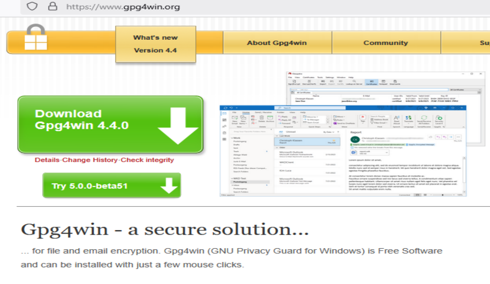
    Clik on download, and you can choose how much you would like to donate, including 0$, then install the program with the default options
    </tr>
    <tr>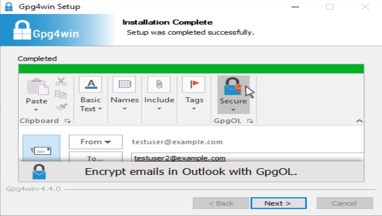</tr>
    <tr>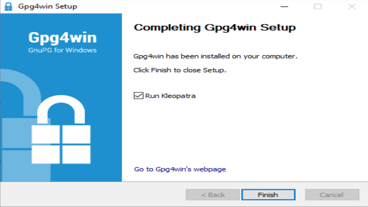</tr>
</table>
</center>
This will open the PGP key manager Kleopatra.
<center>
<table>
    <tr>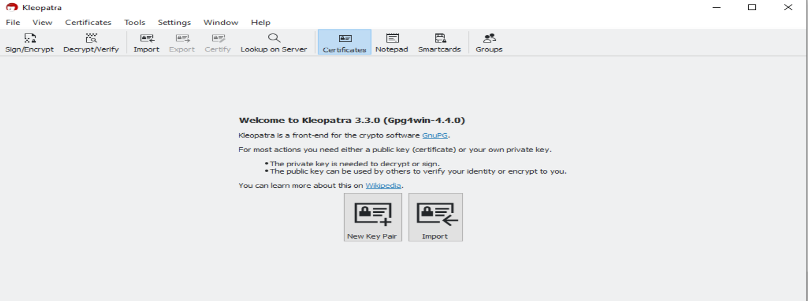<br>
    Click on "New key pair"<br>
    </tr>
    <tr>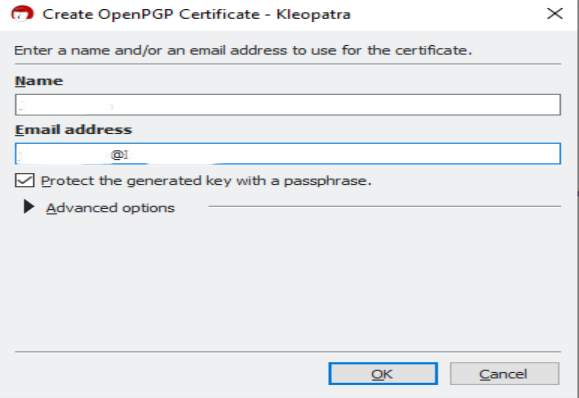<br>
    Enter a name and your email, then tick the "passphrase" option
    </tr>
    <tr>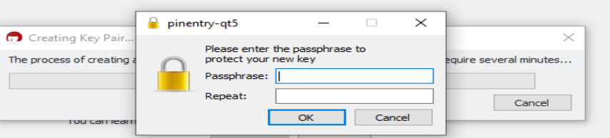
    </tr>
    <tr>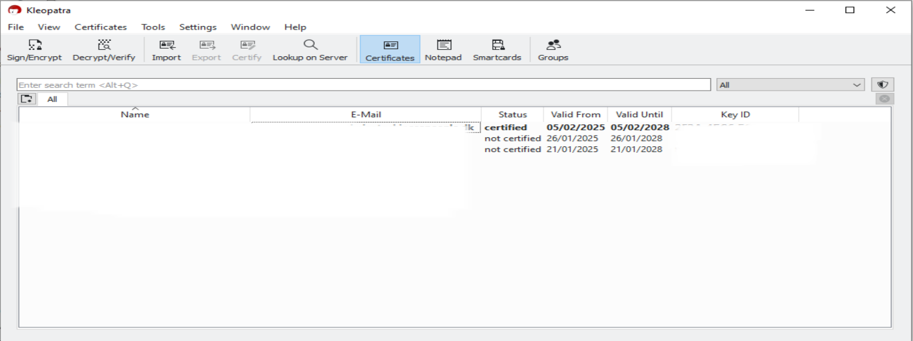<br>
    Click on "Settings"
    </tr>
    <tr>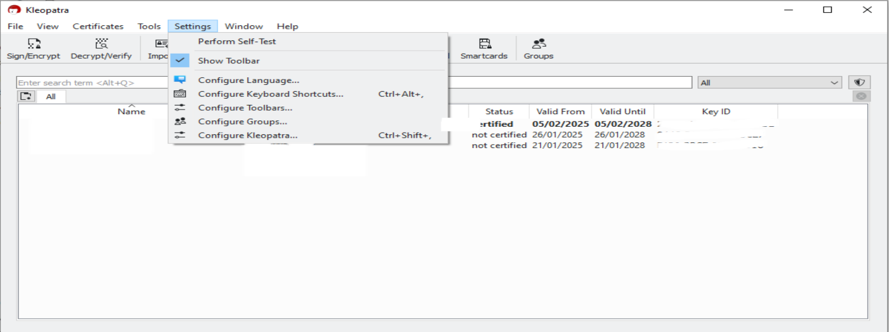<br>
    Then on "Configure Kleopatra"
    </tr>
    <tr>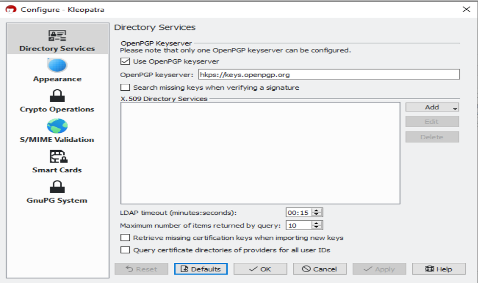<br>
    Set the keyserver "hkps://keys.openpgp.org", then click on "OK"
    </tr>
    <tr>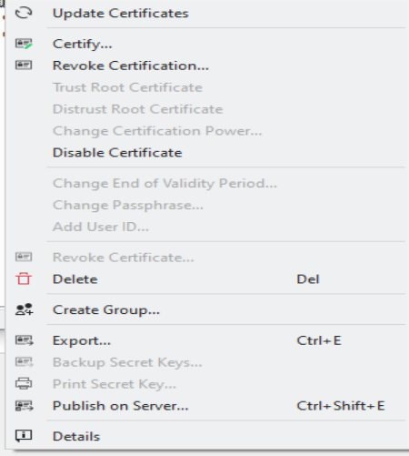<br>
    Right click on your key and click on "Publish on Server" if you want anyone to find your public key, or alternatively export it to a file to give it only to a selected few people.
    </tr>
    <tr>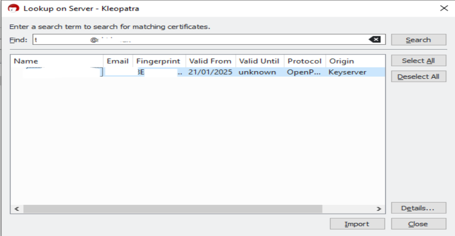<br>
    Click on "Lookup on server" to find keys uploaded on public servers. In the search field enter the full mail address of the person you are looking for<br>
    </tr>
    <tr>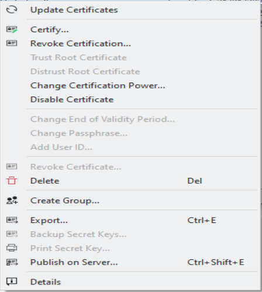<br>
    After importing the key, certify it by right click->certify. Verify the fingerprint with the person you are talking to, either physically or with secure channels, for example using Signal.
    </tr>
    <tr>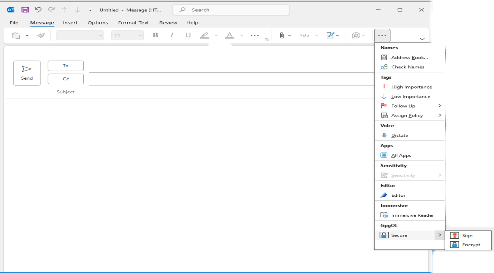<br>
    Open a new mail, and write the mail address of the person you want to write to in the "To" field. Click on the GpgOL option "Secure" and you should see the two options "Sign" and "Encrypt" squared in black, meaning that they are activated. Write your mail (remember to use a vague subject or no subect at all) and then hit "send". That's it ! You can then check on your webmail to see what the server actually receives, which should be only encrypted data. Attachements are also encrypted, if you used any.
    </tr>
</table>
</center>

## All platforms with Mozilla Thunderbird

Once you have a set up thunderbird installation with your mail server, open it and do the following:

<center>
<table>
    <tr><br>
    Right click on your mail address on the left, then click on "Settings" <br>
    </tr>
    <tr>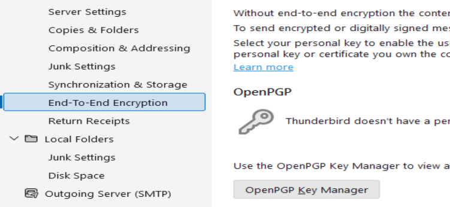<br>
    In the "End to End encryption" section, click on "OpenPGP Key Manager"
    </tr>
    <tr>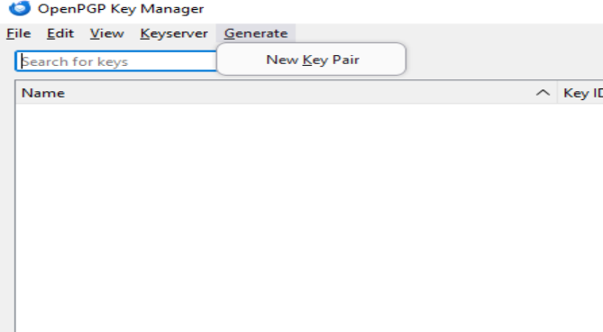
    Click on Generate->New Key Pair
    </tr>
    <tr>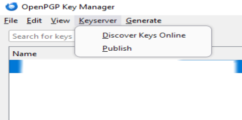<br>
    After the key generation, click on Keyserver->Publish if you want anyone to be able to find your public key. Then you can find enother person public key with Keyserver-Discover Keys Online. Remember to enter the full mail address associated with the key you are looking for in the search field. Alternatively, you can use File->Import Public Key from File and File->Export Public Key to File functions to share your public key to a smaller audience.
    </tr>
    <tr>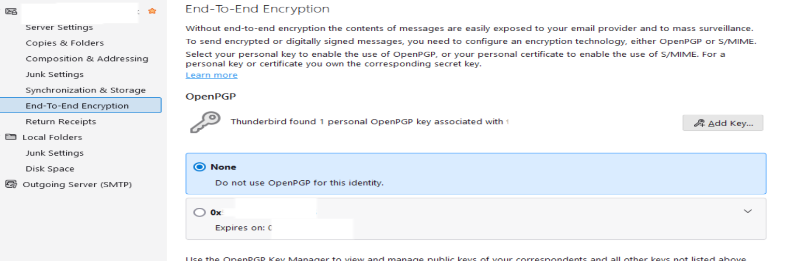<br>
    Go back to Settings, then select your key as the default key for your mail address
    </tr>
    <tr>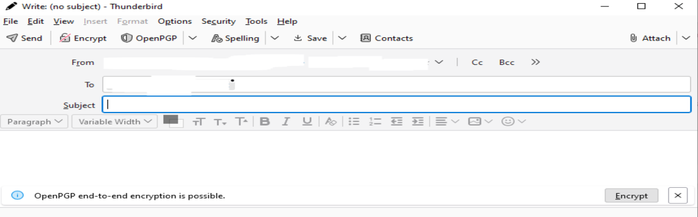<br>
    Open a new mail, and write the mail address of the person you want to write to in the "To" field. You should see appearing the mention "OpenPGP end-to-end-encryption is possible", and you can then click on "Encrypt". You can also click on the Encrypt button next to send to have the same effect. Write your mail (remember to use a vague subject or no subect at all) and then hit "send". That's it ! You can then check on your webmail to see what the server actually receives, which should be only encrypted data. Attachements are also encrypted, if you used any.
    </tr>
    <tr>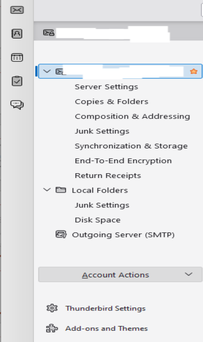<br>
    We need now to activate a master password to encrypt the keys (and also the mails on your computer at rest) by going to Settings->Thunderbird Settings
    </tr>
    <tr>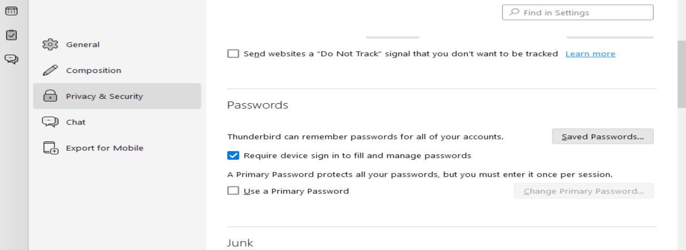<br>
    Then click on "Privacy and Security"->"Use a primary password" and set up a strong passphrase<br>
    </tr>
</table>
</center>

### Encrypting and decrypting files with GPG, regardless of the fact that you use email to transfer them

## Using Windows and GNU4Win

If you are on Windows and have installed GNU4WIN (see above), then you can simply open the file explorer, right click on a file and see the options "sign and encrypt" and "More GpgEx options" to generate an encrypted file with a public key you previously stored with Kleopatra, or to decrypt it with your private key.

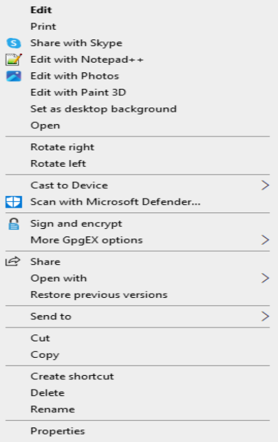

## On all platforms using the command line tool gpg

This command line tool is already installed natively in basically every Linux distribution, and is installed on Windows with the installation of Gnu4Win. On MacOS, it can be installed with homebrew (see above). You can use it to bypass any of the mail system assumption, and therefore transfer things via not only any mail systems, but also other messaging apps, while being certain that it is end to end encrypted.

Here is a cheat sheet for the commands you can enter with it:

| Function     | Command      | Note|
| generate a public/private key pair | ```gpg full-generate-key``` | |
| list all public keys | ```gpg --list-keys``` | you can see the signature of the key, the level of trust under brackets, the validity f the key, and the name and mail addresses|
| list all private keys | ```gpg --list-secret-keys``` | you can see the signature of the key, the level of trust under brackets, the validity f the key, and the name and mail addresses|
| send a key to a keyserver | ```gpg --send-keys [key_id]``` | replace ```[key_id]``` with the fingerprint of the key you want to send. Default to keys.openpgp.org, but this can be changed with the --keyserver option|
| get the fingerprint of a key | ```gpg --fingerprint [mail]``` | replace ```[mail]``` with the mail address of the key you want to investigate |
| search for a public key on a server | ```gpg --search-keys [mail]``` | replace ```[mail]``` with the mail address of the person you want to communicate to. It will return the fingerprint of the found key(s) |
| Receive a key from a keyserver | ```gpg --receive-keys [key_id]``` | replace ```[key_id]``` with the fingerprint of the key you want to receive, that you would tipycally have found with the ```gpg --search-keys [mail]```command above |
| Encrypt a file with GPG | ```gpg --encrypt --recipient [mail] --sign --armor [filename]``` | replace ```[mail]``` with the mail of a person you have the public key of, and ```[filename]``` with the file you want to encrypt. This will create another file named ```filename.asc```which is a text file containing the encrypted data.|
| Decrypt a file with GPG | ```gpg [filename]``` | replace ```[filename]``` with the file you want to decrypt. This will create another file that is the decrypted file.|

